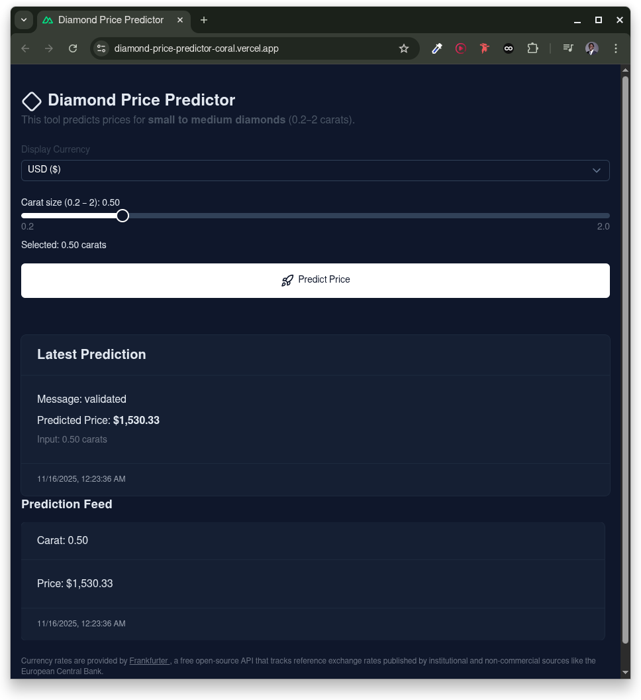

## Diamond Price Predictor

**Know the Real Value of a Diamond — Using Just _Carat_**

## The Problem: Most Buyers Overpay — Even on Small Diamonds

You’re shopping for a **small to mid-sized diamond** (0.2–1.5 carat) — maybe for an engagement ring, gift, or investment.

But jewelers **exploit confusion**:

-   Same 0.7ct diamond? **$1,500 at one store, $3,200 at another**
-   No transparency on **carat-to-price curve**
-   "Premium cut" or "rare color" excuses hide **100%+ markups**

> **Result**: Everyday buyers overpay **$500–$2,000** on modest stones.

## The Solution: **Instant, Data-Backed Price Estimates**

**No jargon. No GIA reports. Just one number.**

Enter **carat weight** → Get **real market price range** in 1 second.

Powered by a **production ML model** trained on **50,000+ real diamond sales**.

## Live Demo

[](https://diamond-price-predictor.vercel.app)  
_No signup. Just enter specs → get price._

## How It Works (For Users)

| Step | What You Do                  | What You Get                                  |
| ---- | ---------------------------- | --------------------------------------------- |
| 1    | Type **carat** (e.g. `0.52`) | Instant validation                            |
| 2    | Click **"Predict Price"**    | **$1,820 – $2,180** (95% confidence)          |
| 3    | See **price curve**          | "0.5ct avg: $1,900"                           |
| 4    | Show jeweler                 | **"I know the data. Let’s talk real price."** |

## Demo Screenshot


_Clean, mobile-friendly UI — works on phone in the store_

### Monorepo layout

```
├── client/                      # Nuxt 4 (Vue 3) SPA
├── server/                      # FastAPI service loading model from MLflow registry
├── diamond_price_predictor_ml/  # Python package for data, features, training
├── docker-compose.yml           # Optional: compose for server (and MLflow UI, if enabled)
├── env.example                  # Template for required environment variables
└── README.md                    # You are here
```

### Tech stack

-   Client: Nuxt 4, Vue 3, Tailwind
-   API: FastAPI, Pydantic, CORS
-   ML: scikit‑learn, MLflow (tracking + model registry), Databricks SDK (auth)

---

## Prerequisites

-   Node.js 18+ (recommended 20+)
-   Python 3.11
-   Poetry 2.x
-   Docker (optional, for containerized run)

---

## Environment variables

Copy `.env.example` to `.env` in the repo root and fill in values:

-   ML & Registry
    -   `MLFLOW_TRACKING_URI` – Tracking server URI (Databricks MLflow or self‑hosted)
    -   `MLFLOW_ARTIFACT_PATH` – Artifact location for new experiments
    -   `MLFLOW_EXPERIMENT_PATH` – Experiment path/name used by server startup
    -   `MLFLOW_EXPERIMENT_NAME` – Human‑readable experiment name
    -   `MLFLOW_MODEL_NAME` – Registered model name to load
    -   `MLFLOW_MODEL_VERSION` – Model version (e.g. 1)
-   Databricks (if using Databricks for MLflow)
    -   `DATABRICKS_HOST`
    -   `DATABRICKS_TOKEN`
-   Server
    -   `CLIENT_URL` – Allowed origin for CORS (e.g. http://localhost:3000)
    -   `SERVER_PORT` – Host port to expose FastAPI (default 8000)
-   Client
    -   `NUXT_PUBLIC_API_BASE` – API base URL (e.g. http://localhost:8000)
-   Optional
    -   `MLFLOW_PORT` – Host port for MLflow UI when enabled in compose

---

## Run locally

### 1) Start the API server

```bash
cd server
poetry install
poetry run fastapi dev server/main.py --port 8000
```

The server will load the MLflow model at startup using:
`models:/{MLFLOW_MODEL_NAME}/{MLFLOW_MODEL_VERSION}`

### 2) Start the client

```bash
cd client
npm install
npm run dev
```

Visit the app at `http://localhost:3000`. Ensure the client `.env` (via `NUXT_PUBLIC_API_BASE`) points to the server.

---

## Optional: Docker

Build and run the API server with compose (MLflow UI section is present but commented):

```bash
docker compose up --build
```

This exposes the FastAPI server on `SERVER_PORT` (default 8000).

---

## API quick test

With the server running:

```bash
curl -X POST "http://localhost:8000/predict" \
  -H "Content-Type: application/json" \
  -d '{"carat": 0.23}'
```

Response (example):

```json
{
	"message": "validated",
	"data": { "carat": 0.23 },
	"df": "...",
	"preds": 1234.56
}
```

---

## How it fits together

-   The ML package (`diamond_price_predictor_ml`) contains data pipelines, feature engineering, training code, and Makefile targets.
-   Experiments are logged to MLflow; the best model is registered under `MLFLOW_MODEL_NAME`.
-   The API (`server`) loads the registered model at startup and exposes `/predict`.
-   The client (`client`) posts diamond features to the API and renders the predicted price.

---

## Useful commands

### ML package (from `diamond_price_predictor_ml/`)

-   Prepare data: `make data`
-   Build features: `make features`
-   Train model: `make train`
-   Generate EDA figures: `make figures`
-   Serve a registered model locally: `make serve PORT=5001 MODEL_NAME=best_model MODEL_VERSION=1`

### Server (from `server/`)

-   Run dev: `poetry run fastapi dev server/main.py --port 8000`

### Client (from `client/`)

-   Dev server: `npm run dev`
-   Build: `npm run build`

---

## Folders of interest

-   `client/app/pages/index.vue` – App UI surface
-   `client/app/types/diamond.ts` – Payload types used by the client
-   `server/server/main.py` – FastAPI app and `/predict` endpoint
-   `server/server/schemas.py` – Pydantic types for request validation
-   `diamond_price_predictor_ml/modeling/train_model.py` – Training entry point

---

## Troubleshooting

-   Model not found at startup: verify `MLFLOW_MODEL_NAME` and `MLFLOW_MODEL_VERSION` exist in your registry.
-   403/401 from MLflow: ensure `DATABRICKS_HOST` and `DATABRICKS_TOKEN` are valid for the tracking URI.
-   CORS errors in the browser: set `CLIENT_URL` to your client origin.
